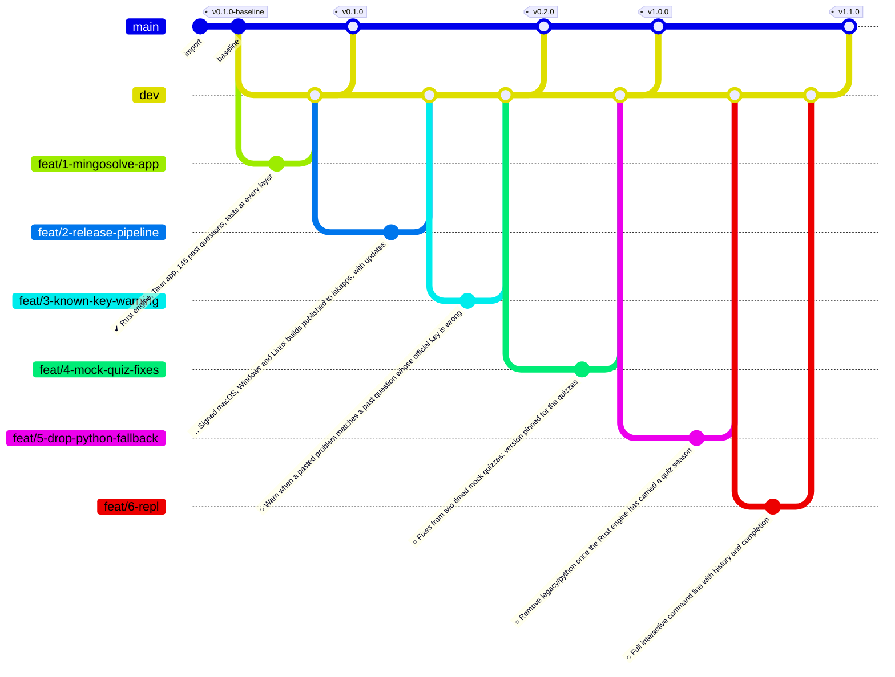

<!--
  Auto-generated from .github/roadmap.yaml by
  .github/scripts/render_roadmap.py. Do not edit this file directly —
  changes will be overwritten on the next run of the `Render ROADMAP`
  workflow. Edit the YAML or close / reopen a tracking issue instead.
-->

# Project roadmap

ISC MingoSolve has to be installed and rehearsed before the January 2027 registration quizzes. Feature freeze on 15 December 2026; only fixes after 1 January. Each phase is a cluster of branches cut from `dev`; a tag on `main` closes the phase once every branch in it has merged. Status badges (✅ / 🔄 / 🔜) come from each branch's tracking issue.

## Phase summary

| Phase | Title | Branches | Milestone tag |
|:---:|---|---|---|
| 1 | Rust engine and desktop app | ✅ done `feat/1-mingosolve-app` | `v0.1.0` |
| 2 | Release and quiz-day features | 🔄 active `feat/2-release-pipeline` · 🔜 planned `feat/3-known-key-warning` | `v0.2.0` |
| 3 | Quiz rehearsal | 🔜 planned `feat/4-mock-quiz-fixes` | `v1.0.0` |
| 4 | After the quizzes | 🔜 planned `feat/5-drop-python-fallback` · 🔜 planned `feat/6-repl` | `v1.1.0` |

## Branch diagram

---

## How this file is maintained

- **Source of truth**: [`.github/roadmap.yaml`](.github/roadmap.yaml)
- **Renderer**: [`.github/scripts/render_roadmap.py`](.github/scripts/render_roadmap.py)
- **Workflow**: [`.github/workflows/roadmap.yml`](.github/workflows/roadmap.yml)

The workflow runs on every push to `dev`. If any branch status changed
(a tracking issue was closed, the YAML was edited, a new branch was
added) it regenerates this file and auto-commits with the message
`chore: regenerate ROADMAP.md [skip ci]`.
